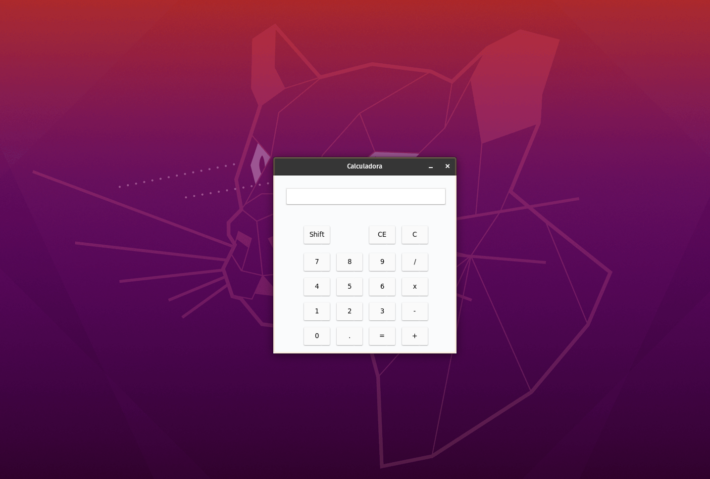

# Calculadora básica

A calculador permitirá que úsuarios façam as suas operações básicas de matemática.

Projeto desenvolvido sozinho em Dezembro de 2020 com a biblioteca Tkinter. Uma maneira de testar as minhas habilidades e tentar fazer algo legal.

## Pré-requisitos

Antes de começar, verifique se você atendeu aos seguintes requisitos:

* Você instalou o python 3.+ ou posterior.
* Você tem uma máquina `Windows ou Linux`.
* Você leu a documentação do [Tkinter](https://docs.python.org/3/library/tkinter.html).

## Preparando o ambiente
No terminal ou cmd digite:
```
pip install -r requirements.txt
```

## Iniciando a Calculadora

Para iniciar, siga estas etapas no diretório raiz:

Linux e macOS:
```
python3 main.py
```

Windows:
```
python main.py
```
## Exemplo




## Colaboradores

Obrigado às seguintes pessoas que contribuíram para este projeto:

* [@sweydabdul] (https://github.com/sweydabdul) 📖


## Contato

Se quiser entrar em contato comigo, você pode entrar em contato comigo em <abdulsweyd@gmail.com>.
